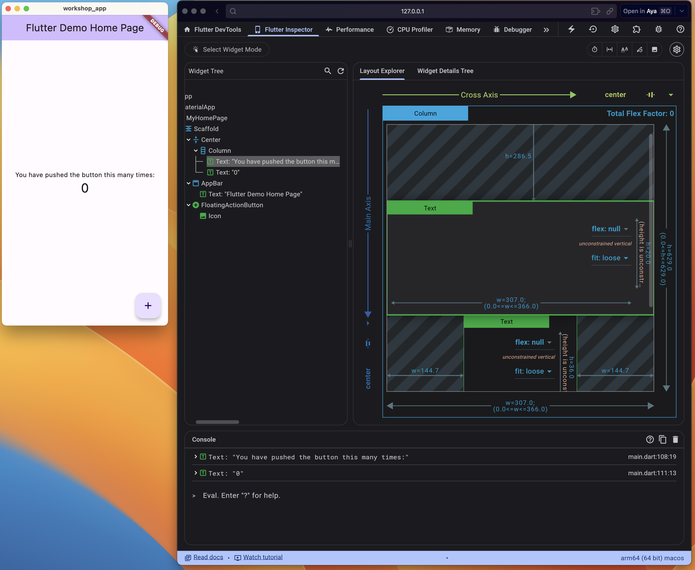

# Aya Flutter Hands on Workshop

Code for the hands on workshop during June 2024 sprint pause

## Pre-workshop Guide

There are some prerequisites you will want to have installed and configured. Follow the  [Pre-workshop guide](https://ayadev.atlassian.net/wiki/spaces/PAUSE/pages/3495329829)

## The guide for the workshop can be found at

[documentation](https://ayadev.atlassian.net/wiki/spaces/ARCH/pages/edit-v2/3503980758)

## Running the Project

Navigate to any step folder in this project, get the dependencies and run the project.

1. `cd step_1`
1. `flutter pub get`
1. `flutter run`

## DevTools

When you execute the flutter run command you will see some information similar to the follow, the http link will provide you an instance of the Flutter Dev Tools you can access in your browser.

```Terminal
Building macOS application...                                           
Syncing files to device macOS...                                    24ms

Flutter run key commands.
r Hot reload. 🔥🔥🔥
R Hot restart.
h List all available interactive commands.
d Detach (terminate "flutter run" but leave application running).
c Clear the screen
q Quit (terminate the application on the device).

A Dart VM Service on macOS is available at: http://127.0.0.1:53815/HF7n7c7NrPk=/
The Flutter DevTools debugger and profiler on macOS is available at: http://127.0.0.1:9100?uri=http://127.0.0.1:53815/HF7n7c7NrPk=/
```



## Unit Tests

To run unit test navigate to the folder you want to run the tests against and then run the test command.

1. `cd step_1`
2. `flutter test`

## Package Management

Package dependencies for the project will be inside the pubspec.yaml file
You can get your package dependencies by running `flutter pub get`.

To update packages run `flutter pub update`

To handle outdated packages run `flutter pub outdated`

To resolve dependency constraints and upgrade packages to the latest run
`flutter pub upgrade --major-versions`
